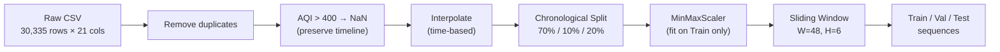

# Air-Quality-Index-AQI-Forecasting-System

A backend pipeline for forecasting the Air Quality Index (AQI) in Hanoi 6 hours ahead (t+6), using multiple model architectures — **LSTM**, **Stacked LSTM**, **GRU**, and **XGBoost (with Lag Features)** — built on PyTorch.

The pipeline takes a 48-hour historical sliding window of environmental and air-quality IoT sensor data as input, and outputs the forecasted AQI value for the next 6 hours.

---

## Table of Contents

- [Key Features](#key-features)
- [System Requirements & Tool Versions](#system-requirements--tool-versions)
- [Installation](#installation)
- [How to Run](#how-to-run)
- [Repository Structure](#repository-structure)
- [Module Descriptions](#module-descriptions)
- [Data Pipeline](#data-pipeline)
- [Results](#results)
- [Future Work](#future-work)

---

## Key Features

- Time-series data processing that preserves temporal continuity, without dropping records
- Training and comparison of multiple model architectures: Base LSTM, Stacked LSTM, GRU, XGBoost
- Automatic hyperparameter optimization with Optuna (Bayesian HPO, TPESampler + MedianPruner)
- Objective evaluation against a Naive Persistence Baseline
- Modular architecture, separated into config / data / model / train / evaluate / visualize / utils
- Logging and reproducibility via fixed random seeds

---

## System Requirements & Tool Versions

| Tool | Version |
|------|---------|
| Python | 3.10+ |
| PyTorch | >= 2.0 |
| scikit-learn | >= 1.0 |
| Optuna | >= 3.0 |
| Pandas | >= 1.5 |
| NumPy | >= 1.23 |
| Matplotlib | >= 3.6 |
| XGBoost | >= 3.0 |

---

## Installation

```bash
# 1. Clone the repository
git clone <repository-url>
cd Air-Quality-Index-AQI-Forecasting-System

# 2. Create a virtual environment
python -m venv .venv

# 3. Activate the virtual environment
# Windows:
.venv\Scripts\activate
# Linux/macOS:
source .venv/bin/activate

# 4. Install dependencies
pip install -r requirements.txt
```

### Dependencies (requirements.txt)

```text
pandas
numpy
torch
scikit-learn
matplotlib
optuna
seaborn
jupyter
xgboost
```

---

## How to Run

program/` directory:

```bash
# Train Base LSTM model
python "main program/main.py"

# Train Stacked LSTM model
python "main program/stacked_main.py"

# Train and evaluate Single-layer GRU
python "main program/run_gru.py"

# Train and evaluate XGBoost (Lag Features, default params)
python "main program/run_xgb.py"

# HPO + retrain: Tuned Base LSTM
python "main program/tune_main.py"

# HPO + retrain: Tuned Stacked LSTM
python "main program/tune_stacked_main.py"

# HPO + retrain: Tuned GRU
python "main program/tune_gru_main.py"

# HPO + retrain: Tuned XGBoost
python "main program/tune_xgb_main.py"

# Generate overlay comparison charts
python compare_tuned_models.py
python compare_tuned_vs_untuned.py
```

Logs, loss-curve plots, and prediction charts are saved to the `results/` folder.

---

## Repository Structure

```text
Air-Quality-Index-AQI-Forecasting-System/
├── src/                          # Core package
│   ├── config.py                 # Global hyperparameters, feature columns, split ratios, device, seed
│   ├── data_loader.py            # Data pipeline (+ get_xgboost_data)
│   ├── model.py                  # LSTMAQIModel, StackedLSTMAQIModel, GRUAQIModel
│   ├── train.py                  # Training loop with early stopping
│   ├── tune.py                   # Optuna objective functions
│   ├── evaluate.py               # Metrics + persistence baseline
│   ├── visualize.py              # Plotting utilities
│   └── utils.py                  # DualLogger context manager
├── main program/                 # Entry points for training / tuning
│   ├── main.py                   # Entry point: Base LSTM
│   ├── stacked_main.py           # Entry point: Stacked LSTM
│   ├── run_gru.py                # Entry point: Single-layer GRU
│   ├── run_xgb.py                # Entry point: XGBoost (Lag Features)
│   ├── tune_main.py              # Entry point: HPO + train Tuned Base LSTM
│   ├── tune_stacked_main.py      # Entry point: HPO + train Tuned Stacked LSTM
│   ├── tune_xgb_main.py          # Entry point: HPO + train Tuned XGBoost
│   └── tune_gru_main.py          # Entry point: HPO + train Tuned GRU
├── Dataset/                      # Raw dataset
│   ├── archive/                  # CSV files (air quality data)
│   └── Copy of Air Quality ForeCasting.ipynb  # Original research notebook
├── results/                      # Run outputs
│   ├── base_results.txt          # Base LSTM run log
│   ├── stacked_results.txt       # Stacked LSTM run log
│   ├── tuned_results_*.txt       # Tuned model run logs
│   ├── gru_results.txt           # GRU run log
│   ├── xgb_results.txt           # XGBoost run log
│   ├── *_loss_curve.png          # Loss curve plots
│   └── *_test_predictions.png    # Prediction charts
├── requirements.txt              # Dependencies
└── README.md                     # Project description
```

---

## Module Descriptions

| Module | File | Function |
|--------|------|----------|
| **Configuration** | `src/config.py` | Defines all hyperparameters, feature columns, data split ratios, device, and random seed |
| **Data Processing** | `src/data_loader.py` | Reads CSV, handles outliers (AQI > 400 → NaN), extracts time features (hour, month), interpolates, performs chronological split, scales using MinMaxScaler, creates sliding-window sequences, and creates PyTorch DataLoaders. Also supports `get_xgboost_data()` to return flattened arrays for XGBoost |
| **Models** | `src/model.py` | Defines `LSTMAQIModel` (1-layer LSTM), `StackedLSTMAQIModel` (2-layer LSTM), `GRUAQIModel` (1-layer GRU): all following the RNN + Dropout + Linear(hidden→1) structure |
| **Training** | `src/train.py` | Training loop with early stopping, checkpointing, and trial pruning support for Optuna |
| **HPO Tuning** | `src/tune.py` | Objective functions for Optuna – samples lr, hidden_size, dropout, weight_decay; trains and returns best val loss |
| **Evaluation** | `src/evaluate.py` | Calculates RMSE, MAE on unscaled data; calculates Naive Persistence Baseline |
| **Visualization** | `src/visualize.py` | Plots loss curves and actual vs. predicted AQI charts |
| **Utilities** | `src/utils.py` | `DualLogger` – a context manager that logs output to both console and file simultaneously, ensuring exception safety |

### LSTM / GRU Model Architecture

```text
Input: (batch_size, 48, 13)    ← 48 timesteps × 13 features
         │
    ┌────▼────┐
    │  LSTM   │  hidden_size = 128 (base) / 256 (tuned)
    │  (or    │  num_layers = 1 (Base/GRU) or 2 (Stacked)
    │  GRU)   │  batch_first = True
    └────┬────┘
         │  h_n[-1] → (batch_size, hidden_size)
    ┌────▼────┐
    │ Dropout │  p = 0.2 (base) / tuned
    └────┬────┘
    ┌────▼────┐
    │ Linear  │  hidden_size → 1
    └────┬────┘
         │
Output: (batch_size, 1)        ← forecasted AQI at t+6
```

### XGBoost (Lag Features) Model Architecture

```text
Input 3D: (N, 48, 13)
         │  reshape / flatten
Input 2D: (N, 624)   ← 48 timesteps × 13 features = 624 lag features
         │
    ┌────▼────────────────┐
    │  XGBRegressor        │  booster = gbtree, max_depth = 5 (tuned)
    │  (Gradient Boosting) │  eta = 0.0349 (tuned)
    └────┬────────────────┘
         │
Output: (N,)   ← forecasted AQI at t+6
```

---

## Data Pipeline



Dataset used: Hanoi air-quality time-series dataset (08/2022 – 06/2025, 30,335 rows × 21 columns), including AQI, PM2.5, PM10, CO, NO₂, O₃, SO₂, temperature, humidity, wind speed, and pressure.

Processing principles:
- Never break the timeline when handling outliers (use NaN + interpolation instead of deleting rows)
- Avoid data leakage (fit the scaler only on the training set)
- Split the data chronologically

---

## Results

### Test Set Performance vs. Baseline

| Model / Baseline | Test RMSE | Test MAE |
| :--- | :---: | :---: |
| Naive Baseline (Persistence) | 49.1951 | 36.8173 |
| Base LSTM | 41.2524 | 32.3012 |
| Stacked LSTM | 41.0533 | 31.7970 |
| Tuned Base LSTM | 40.9869 | 31.7906 |
| Tuned Stacked LSTM | 40.8716 | 31.5892 |
| Single-layer GRU | 40.6944 | 31.9603 |
| Tuned Single-layer GRU | 40.4583 | 31.3893 |
| XGBoost (Lag Features) | 39.8709 | 30.4246 |
| **Tuned XGBoost** | **39.6817** | **30.2843** |

All trained models clearly outperform the Naive Persistence Baseline. **Tuned XGBoost** achieves the best overall test performance, benefiting from Bayesian hyperparameter optimization that reduced its train/val overfitting gap from 5.42 to 2.68 RMSE points, which in turn translated into a real (if modest) generalization gain on the test set.

For the full breakdown of train/validation performance, hyperparameter analysis, loss curves, and actual-vs-predicted AQI charts, see the full project report.

---

## Future Work

- Integrate real-time IoT ingestion via REST API or MQTT instead of running offline on static CSV files
- Improve forecasting of high AQI spikes (>200) using Huber Loss, Quantile Loss, or oversampling
- Extend hyperparameter tuning coverage and trial budget for XGBoost
- Extend to multi-step forecasting (t+1 through t+24) instead of single-step t+6
- Explore Transformer/Attention architectures or an ensemble of LSTM and XGBoost

---

## License

Not yet specified.
