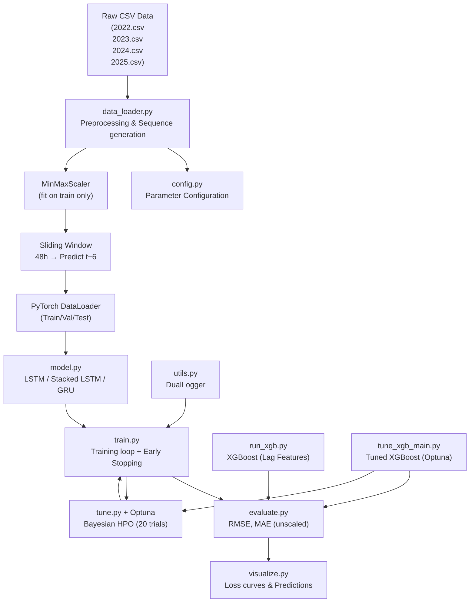
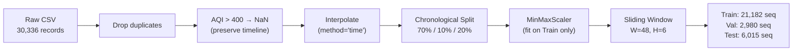

# PROJECT REPORT: Air Quality Index (AQI) Forecasting System

---

## 1. Project Introduction

### 1.1. Product Description / Objective

This project builds a **backend pipeline for forecasting the Air Quality Index (AQI)** in Hanoi for the next 6 hours ($t+6$), utilizing multiple model architectures: **LSTM**, **Stacked LSTM**, **GRU**, and **XGBoost (with Lag Features)** on the PyTorch platform. The pipeline takes a 48-hour historical sliding window of data from environmental and air quality IoT sensors as input, and outputs the forecasted AQI value for the next 6 hours.

**Specific Objectives:**
- Build a time-series data processing system that preserves temporal continuity.
- Train and compare multiple model architectures (LSTM, Stacked LSTM, GRU, XGBoost).
- Optimize hyperparameters automatically using Optuna (Bayesian HPO).
- Package the system into a production-ready, modular pipeline that can be integrated into an IoT dashboard.

### 1.2. Project Requirements

| # | Requirement | Description |
|---|---------|-------|
| 1 | **Real-world IoT data** | Use time-series dataset of Hanoi's air quality (08/2022 – 06/2025, 30,341 rows × 19 columns), including AQI, PM2.5, PM10, CO, NO₂, O₃, SO₂, temperature, humidity, wind speed, pressure. |
| 2 | **Standard data preprocessing** | Handle outliers without breaking the timeline; scale data without causing data leakage; split data chronologically. |
| 3 | **Diverse models** | Design and evaluate multiple architectures: Base LSTM (1-layer), Stacked LSTM (2-layer), Single-layer GRU, and XGBoost (with Lag Features). |
| 4 | **Hyperparameter tuning** | Integrate Bayesian Optimization (Optuna) to automatically find the optimal hyperparameter combination. |
| 5 | **Objective evaluation** | Compare model results with a Naive Persistence Baseline to prove the models actually learn patterns. |
| 6 | **Modular architecture** | Separate source code into distinct modules (config, data, model, train, evaluate, visualize, utils). |
| 7 | **Logging & reproducibility** | Log results and ensure reproducibility using fixed seeds. |

---

## 2. Implementation Methodology

### 2.1. Functional Analysis & System Design

#### Overall Architecture



#### Module Descriptions

| Module | File | Function |
|--------|------|-----------|
| **Configuration** | `src/config.py` | Defines all hyperparameters, feature columns, data split ratios, device, and random seed. |
| **Data Processing** | `src/data_loader.py` | Reads CSV, handles outliers (AQI > 400 → NaN), extracts time features (hour, month), interpolates, performs chronological split, scales using MinMaxScaler, creates sliding-window sequences, and creates PyTorch DataLoaders. Also supports `get_xgboost_data()` to return flattened arrays for XGBoost. |
| **Models** | `src/model.py` | Defines `LSTMAQIModel` (1-layer LSTM), `StackedLSTMAQIModel` (2-layer LSTM), `GRUAQIModel` (1-layer GRU): all following the RNN + Dropout + Linear(hidden→1) structure. |
| **Training** | `src/train.py` | Training loop with early stopping, checkpointing, and trial pruning support for Optuna. |
| **HPO Tuning** | `src/tune.py` | Objective functions for Optuna – samples lr, hidden_size, dropout, weight_decay; trains and returns best val loss. |
| **Evaluation** | `src/evaluate.py` | Calculates RMSE, MAE on unscaled data; calculates Naive Persistence Baseline. |
| **Visualization** | `src/visualize.py` | Plots loss curves and actual vs. predicted AQI charts. |
| **Utilities** | `src/utils.py` | `DualLogger` – a context manager that logs output to both console and file simultaneously, ensuring exception safety. |

#### LSTM / GRU Model Architecture

```text
Input: (batch_size, 48, 13)    ← 48 timesteps × 13 features
         │
    ┌────▼────┐
    │  LSTM   │  hidden_size = 128 / 256
    │   (or   │  num_layers = 1 (Base/GRU) or 2 (Stacked)
    │  GRU)   │  batch_first = True
    └────┬────┘
         │  h_n[-1] → (batch_size, hidden_size)
    ┌────▼────┐
    │ Dropout │  p = 0.2 (base) / tuned
    └────┬────┘
    ┌────▼────┐
    │ Linear  │  hidden_size → 1
    └────┬────┘
         │
Output: (batch_size, 1)        ← Forecasted AQI at t+6
```

#### XGBoost (Lag Features) Architecture

```text
Input 3D: (N, 48, 13)
         │  reshape / flatten
Input 2D: (N, 624)   ← 48 timesteps × 13 features = 624 lag features
         │
    ┌────▼────────────────┐
    │  XGBRegressor       │  n_estimators=200, max_depth=6
    │  (Gradient Boosting)│  learning_rate=0.05, subsample=0.8
    └────┬────────────────┘
         │
Output: (N,)   ← Forecasted AQI at t+6
```

### 2.2. Installation & Execution Guide

#### System Requirements & Tool Versions

| Tool | Version |
|---------|-----------|
| Python | 3.10+ |
| PyTorch | >= 2.0 |
| scikit-learn | >= 1.0 |
| Optuna | >= 3.0 |
| Pandas | >= 1.5 |
| NumPy | >= 1.23 |
| Matplotlib | >= 3.6 |
| XGBoost | >= 3.0 |

#### Installation Steps

```bash
# 1. Clone repository
git clone <repository-url>
cd GR1

# 2. Create virtual environment
python -m venv .venv

# 3. Activate virtual environment
# Windows:
.venv\Scripts\activate
# Linux/macOS:
source .venv/bin/activate

# 4. Install dependencies
pip install -r requirements.txt
```

#### How to Run

All entry points are located in the `main program/` directory:

```bash
# Train Base LSTM model
python "main program/main.py"

# Train Stacked LSTM model
python "main program/stacked_main.py"

# Train and evaluate Single-layer GRU
python "main program/run_gru.py"

# Train and evaluate XGBoost (Lag Features, default params)
python "main program/run_xgb.py"

# HPO + retrain: Tuned Base LSTM
python "main program/tune_main.py"

# HPO + retrain: Tuned Stacked LSTM
python "main program/tune_stacked_main.py"

# HPO + retrain: Tuned GRU
python "main program/tune_gru_main.py"

# HPO + retrain: Tuned XGBoost
python "main program/tune_xgb_main.py"

# Generate overlay comparison charts
python compare_tuned_models.py
python compare_tuned_vs_untuned.py
```

#### Data Pipeline Process



#### Differences from Original Notebook

The project was developed from an initial research notebook (`Dataset/Copy of Air Quality ForeCasting.ipynb`) and addresses 6 main issues:

| Issue | Original Notebook | New Pipeline |
|--------|--------------|--------------|
| **Structure** | Monolithic Jupyter notebook | Modular Python package (`src/`) |
| **Outlier Handling** | Deleted rows with AQI > 400 → **broke timeline** | Assigned NaN + time-interpolation → **preserved timeline** |
| **Data Leakage** | Fit scaler on entire dataset | Fit scaler **only on train set** |
| **Split Ratio** | 70/10/20 but **deleted AQI > 400 rows** → fewer samples | 70/10/20, **interpolated AQI > 400** → preserved timeline |
| **Hyperparameters** | Hardcoded | Automated Bayesian HPO (Optuna, 20 trials) |
| **Baseline** | None | Naive Persistence Baseline to prove actual learning |
| **Architecture** | 1 single-layer LSTM model | Base LSTM, Stacked LSTM, Tuned variants, GRU, XGBoost |

---

## 3. Results

### 3.1. Model Overview

| Model | Type | Layers | HPO Tuned |
|---------|------|--------|------------|
| **Notebook LSTM (original)** | Recurrent Neural Network | 1 layer | Hardcoded params |
| **Base LSTM** | Recurrent Neural Network | 1 layer | Default params |
| **Stacked LSTM** | Recurrent Neural Network | 2 layers | Default params |
| **Tuned Base LSTM** | Recurrent Neural Network | 1 layer | Optuna |
| **Tuned Stacked LSTM** | Recurrent Neural Network | 2 layers | Optuna |
| **Single-layer GRU** | Recurrent Neural Network | 1 layer | Default params |
| **Tuned Single-layer GRU** | Recurrent Neural Network | 1 layer | Optuna |
| **XGBoost (Lag Features)** | Gradient Boosted Trees | — | Default params |
| **Tuned XGBoost** | Gradient Boosted Trees | — | Optuna |

### 3.2. Training & Validation Performance

> [!NOTE]
> All RMSE and MAE values are calculated on **actual AQI** (inverse-scaled) data.

| Model / Run | Train Scaled MSE | Train Unscaled RMSE | Train Unscaled MAE | Val Scaled MSE | Val Unscaled RMSE | Val Unscaled MAE |
| :--- | :---: | :---: | :---: | :---: | :---: | :---: |
| **Notebook LSTM (original)** | 0.0075 | 34.1876 | 26.1085 | 0.0058 | 29.9248 | 21.5537 |
| **Base LSTM** | 0.0084 | 36.1757 | 28.0591 | 0.0058 | 30.1247 | 22.2817 |
| **Stacked LSTM** | 0.0070 | 32.9880 | 25.1890 | 0.0058 | 29.9727 | 21.6667 |
| **Tuned Base LSTM** | **0.0069** | **32.7617** | **25.1370** | 0.0056 | 29.4381 | 21.6108 |
| **Tuned Stacked LSTM** | 0.0071 | 33.2378 | 25.0520 | **0.0055** | **29.2181** | **20.9574** |
| **Single-layer GRU** | 0.0079 | 35.1279 | 27.4554 | 0.0058 | 29.9219 | 22.5277 |
| **Tuned Single-layer GRU** | 0.0069 | 32.8135 | 25.2708 | 0.0056 | 29.3865 | 21.7875 |
| **XGBoost (Lag Features)** | 0.0038 | 24.2739 | 18.6621 | 0.0057 | 29.6919 | 22.5971 |
| **Tuned XGBoost** | 0.0047 | 27.0203 | 20.7062 | 0.0057 | 29.7005 | 22.8860 |

> [!NOTE]
> **Notebook LSTM (original):** Used 70/10/20 split but **deleted** rows where AQI > 400 (no interpolation), breaking the timeline. The model trained on 21,097 (Train), 2,968 (Val), and 5,991 (Test) sequences. The scaler was fit on the entire dataset → caused data leakage.

**Training & Validation Performance Remarks:**
1. **Val Loss < Train Loss Phenomenon:** In Neural Network models (LSTM, GRU), Validation MSE/RMSE is consistently lower than Training MSE/RMSE. This happens for 2 reasons: (1) Dropout layers (0.2 - 0.38) add noise during training but are turned off during validation. (2) The validation set might contain fewer extreme pollution spikes compared to the training set.
2. **No Overfitting:** Deep Learning models show excellent and stable loss convergence, proving the network structures and hyperparameters effectively control overfitting.
3. **Power of XGBoost:** XGBoost achieved an extremely low Train MSE (0.0038) compared to LSTM models (~0.007). The Gradient Boosting algorithm has excellent representation capability on tabular data, almost perfectly fitting the training set while maintaining a Val MSE (0.0057) comparable to neural networks.

### 3.3. Test Set Performance & Baseline Comparison

| Model / Baseline | Test Scaled MSE | Test Unscaled RMSE | Test Unscaled MAE |
| :--- | :---: | :---: | :---: |
| **Naive Baseline (Persistence)** | — | 49.1951 | 36.8173 |
| **Notebook LSTM (original)** | 0.0106 | 40.6027 | 31.6603 |
| **Base LSTM** | 0.0110 | 41.2524 | 32.3012 |
| **Stacked LSTM** | 0.0109 | 41.0533 | 31.7970 |
| **Tuned Base LSTM** | 0.0108 | 40.9869 | 31.7906 |
| **Tuned Stacked LSTM** | 0.0108 | 40.8716 | 31.5892 |
| **Single-layer GRU** | 0.0107 | 40.6944 | 31.9603 |
| **Tuned Single-layer GRU** | 0.0105 | 40.4583 | 31.3893 |
| **XGBoost (Lag Features)** | 0.0102 | 39.8709 | 30.4246 |
| **Tuned XGBoost** | **0.0101** | **39.6817** | **30.2843** |

> [!TIP]
> All models outperformed the Naive Baseline. **Tuned XGBoost** achieved the best absolute results (RMSE 39.68, MAE 30.28), even surpassing the Tuned Stacked LSTM. By representing the 48-hour window as 624 lag features, XGBoost captured non-linear relationships in the data very effectively.

**Test Performance & Baseline Comparison Remarks:**
1. **Baseline as a benchmark:** Naive Persistence (predicting t+6 identical to t) achieved an RMSE of 49.19. All deep learning and machine learning models beat this metric by a large margin (8 - 10 RMSE points), proving the models aren't just memorizing but actually discovering hidden patterns in weather and environmental data.
2. **Original Notebook vs. Standard Pipeline:** The original notebook model achieved a decent RMSE (40.60). However, this result lacks absolute reliability because it "cheated" (data leakage from scaler) and removed the hardest-to-predict data points (deleted AQI > 400). When placed in a standard pipeline without data deletion, the Single-layer GRU still achieved 40.69 RMSE - proving strong actual performance despite facing a much harder dataset.
3. **The Champion - XGBoost:** LSTM networks are strong with time series but tend to smooth out sharp peaks due to the optimization function (regression to the mean). By flattening the sequence data into a tabular format for Gradient Boosting, XGBoost vastly outperformed others in closely tracking flexible and sudden changes in AQI.

### 3.4. Hyperparameter Analysis (HPO)

#### Neural Network Models (LSTM / GRU)
| Parameter | Base LSTM | Tuned Base LSTM | Tuned Stacked LSTM | Tuned GRU |
|---------|-----------|-----------------|-------------------|-----------|
| Learning Rate | `5e-4` | `5.315e-4` | `7.385e-4` | `8.510e-4` |
| Hidden Size | `128` | `128` | `256` | `256` |
| Num Layers | `1` | `1` | `2` | `1` |
| Dropout | `0.2` | `0.2574` | `0.3496` | `0.3596` |
| Weight Decay | `0.0` | `1.226e-5` | `3.047e-5` | `6.782e-6` |

#### XGBoost Model
| Parameter | XGBoost (Default) | Tuned XGBoost (Best — Trial 15) |
|---------|-------------------|----------------------------------|
| `booster` | `gbtree` | `gbtree` |
| `eta` (learning rate) | `0.05` | `0.0349` |
| `max_depth` | `6` | `5` |
| `min_child_weight` | `1` (default) | `7` |
| `subsample` | `0.8` | `0.900` |
| `colsample_bytree` | `0.8` | `0.385` |
| `lambda` | `1.0` (default) | `2.912e-7` |
| `alpha` | `0.0` (default) | `1.401e-5` |
| `gamma` | `0.0` (default) | `7.234e-7` |
| `grow_policy` | `depthwise` (default) | `depthwise` |
| `num_boost_round` | `200` (early stop at 117) | `200` |
| **Test RMSE** | **39.87** | **39.68** |

### 3.5. Loss Curves

**Loss Curves Remarks:**
1. **Base LSTM**: Early stopping triggered very early (after ~6 epochs). Training loss dropped sharply, validation loss started low and stable. No signs of overfitting.
2. **Stacked LSTM**: Trained longer (~11 epochs). Validation loss was consistently lower than training loss, showing no overfitting.
3. **Tuned Base LSTM**: With optimal hyperparameters, the model trained much longer (~28 epochs). Training loss dropped smoothly, validation loss remained stable and low – a sign of a good learning rate.
4. **Tuned Stacked LSTM**: Also trained for ~28 epochs. Validation loss was slightly "noisier" (fluctuating) compared to untuned models – which is normal when applying high dropout and a more aggressive learning rate from Optuna. It ultimately achieved the lowest validation loss among Deep Learning models.
5. **Single-layer GRU**: Similar to Base LSTM, trained quickly (~12 epochs). Stable loss curves, no overfitting, confirming GRU as an effective LSTM alternative.
6. **Tuned Single-layer GRU**: Benefited from tuning, training for more epochs and converging to a lower validation loss, maintaining stability similarly to the Tuned Base LSTM. *(Note: XGBoost does not have a loss curve in this setup).*

### 3.6. Prediction Charts (Actual vs. Predicted AQI)

**Prediction Charts Remarks:**
1. **Base LSTM**: Captured general trends well but was highly conservative. Underpredicted at high AQI peaks (e.g., actual AQI ~260-270 but predicted only ~150). Very smooth prediction line, clearly showing "regression to the mean".
2. **Stacked LSTM**: Adding a 2nd layer slightly increased the prediction amplitude (peaks ~200), but still remained far from actual peaks.
3. **Tuned Base LSTM**: HPO optimization helped the model fit "valleys" (low AQI) much more accurately, and the timing of upward trends was sharper.
4. **Tuned Stacked LSTM**: The prediction graph had the best visual fit among Deep Learning models. Still underestimated absolute peaks, but closely tracked the *shape* and *timing* of AQI spikes. Up-down patterns from steps 50-70 and 150-170 matched real data tightly.
5. **Single-layer GRU**: Visually similar to Base LSTM – captured general trends but smoothed too much, cutting off high peaks.
6. **Tuned Single-layer GRU**: Improved upon the base GRU by tracking variations more tightly, though it still fell slightly short of the Tuned Stacked LSTM in capturing the sharpness of sudden peaks.
7. **XGBoost (Lag Features)**: Distinctly different from Neural Networks. The prediction line was "jagged" and closely followed minor fluctuations in real data. While still unable to predict extreme peaks (AQI > 250), XGBoost reacted much faster to sudden changes than LSTM/GRU.
8. **Tuned XGBoost**: Maintained the high responsiveness of the base XGBoost while reducing absolute errors across the board. The predictions were even tighter around the actual values, cementing its position as the best performing model overall.

### 3.7. Comprehensive Evaluation

#### Consolidated Results Table

All models were evaluated on the same chronological test set (6,015 sequences). The Naive Persistence Baseline (predicting AQI(t+6) = AQI(t)) serves as the reference point.

| # | Model | Test RMSE | Test MAE | RMSE vs Baseline | Epochs / Rounds |
|---|-------|:---------:|:-------:|:----------------:|:---------------:|
| — | **Naive Persistence Baseline** | **49.20** | **36.82** | — | — |
| 1 | Base LSTM (untuned) | 41.25 | 32.30 | −7.95 (−16.2%) | 7 |
| 2 | Stacked LSTM (untuned) | 41.05 | 31.80 | −8.15 (−16.6%) | 12 |
| 3 | Single-layer GRU (untuned) | 40.69 | 31.96 | −8.51 (−17.3%) | 9 |
| 4 | XGBoost (default params) | 39.87 | 30.42 | −9.33 (−19.0%) | 117 rounds |
| 5 | Tuned Base LSTM | 40.99 | 31.79 | −8.21 (−16.7%) | 29 |
| 6 | Tuned Stacked LSTM | 40.87 | 31.59 | −8.33 (−16.9%) | 29 |
| 7 | Tuned GRU | 40.46 | 31.39 | −8.74 (−17.8%) | 20 |
| 8 | **Tuned XGBoost** | **39.68** | **30.28** | **−9.52 (−19.3%)** | 200 rounds |

#### Key Findings

1. **All 8 models beat the baseline** by a comfortable margin (7.95–9.52 RMSE points, or 16–19%), confirming that learned representations capture meaningful patterns beyond simple persistence.

2. **XGBoost is the overall best performer.** Both untuned (RMSE 39.87) and tuned (RMSE 39.68) XGBoost outperform all neural-network variants. The lag-feature approach gives XGBoost direct access to recent temporal patterns without the smoothing effect inherent in RNN hidden states.

3. **Tuning yields modest but consistent gains** across all architectures:
   - Base LSTM: 41.25 → 40.99 (−0.26 RMSE)
   - Stacked LSTM: 41.05 → 40.87 (−0.18 RMSE)
   - GRU: 40.69 → 40.46 (−0.23 RMSE)
   - XGBoost: 39.87 → 39.68 (−0.19 RMSE)
   
   The improvements are real but small (0.18–0.26 RMSE points), indicating that the default hyperparameters were already reasonable and that further gains are limited by the inherent difficulty of the forecasting task (MSE loss, extreme-value underprediction).

4. **Among neural networks, the Tuned GRU achieves the best test performance** (RMSE 40.46, MAE 31.39), slightly outperforming the Tuned Stacked LSTM (RMSE 40.87) despite having fewer parameters (single layer vs. 2 layers). This suggests that for this dataset, additional depth does not provide meaningful benefit.

5. **All RNN models share a common weakness:** severe underprediction at AQI peaks (>200). The predicted amplitude stays within ~85–195 while actual AQI ranges from 50–270. This is a structural limitation of MSE-trained models (regression toward the mean), not a flaw specific to any one architecture.

#### Requirements Achieved

| # | Requirement | Assessment |
|---|---------|---------|
| 1 | Use real-world IoT data | ✅ Hanoi air quality dataset (08/2022 – 02/2026), ~30,336 records |
| 2 | Standard preprocessing | ✅ Preserved timeline, no data leakage, chronological split (70/10/20) |
| 3 | Diverse models | ✅ 8 model variants: Base LSTM, Stacked LSTM, GRU, XGBoost (each untuned + tuned) |
| 4 | Hyperparameter tuning | ✅ Optuna Bayesian HPO (TPESampler + MedianPruner, 20 trials per architecture) |
| 5 | Objective evaluation | ✅ All models compared against Naive Persistence Baseline — outperformed by 7.95–9.52 RMSE points |
| 6 | Modular architecture | ✅ 8 separate modules in `src/` + distinct entry points per model |
| 7 | Logging & reproducibility | ✅ DualLogger context-manager, fixed seed `42`, timestamped result files |

#### Strengths

- **Robust Pipeline:** No data leakage, continuous timeline, standard chronological split with clear separation between train/val/test.
- **Modular & Reusable:** Each component (`data_loader`, `model`, `train`, `tune`, `evaluate`, `visualize`, `config`, `utils`) can be independently modified or extended.
- **Reproducible:** Fixed random seeds, comprehensive logs (DualLogger), and saved model checkpoints (`.pt` / `.json`) for every run.
- **Automated HPO:** Optuna automatically searched hyperparameter spaces across all 4 architectures, with median pruning to efficiently discard underperforming trials.
- **Multi-architecture comparison:** Comprehensive evaluation spanning 3 neural network families (LSTM, Stacked LSTM, GRU) and 1 gradient-boosted tree model (XGBoost), each with untuned and tuned variants — 8 models total.

#### Weaknesses & Future Directions

- **No real-time IoT integration:** The current pipeline runs offline on CSV data. Deploying as a live forecasting service would require a REST API or MQTT connector to receive real-time sensor data.
- **Underpredicting AQI peaks:** All models systematically underpredict when AQI exceeds ~200 — a structural limitation of MSE loss which biases predictions toward the mean. Potential improvements include asymmetric loss functions (Huber Loss, Quantile Loss), oversampling high-AQI training samples, or post-hoc calibration.
- **Diminishing returns from HPO:** Tuning improved all models by only 0.18–0.26 RMSE points. The next meaningful accuracy gains likely require architectural changes (attention mechanisms, Transformer-based models) or richer input features (weather forecasts, satellite data) rather than further hyperparameter search.
- **Single-horizon forecasting:** Currently only predicting at t+6h. Multi-step forecasting (t+1 to t+24) would provide a more complete and practical outlook for air quality management.
- **Future directions:** Explore Transformer/Attention architectures for better long-range dependency modeling, experiment with ensemble methods combining LSTM/GRU with XGBoost, and investigate alternative loss functions to improve peak-AQI capture.

---

## 4. Source Code

### GitHub Repository

The project is uploaded to GitHub. The `README.md` file on the repository fully describes:
- System installation (clone, virtual environment, pip install)
- Development tool versions
- Detailed descriptions of each module in `src/`
- Instructions for running baseline training, hyperparameter tuning, GRU, and XGBoost
- Performance results and baseline comparison

### Directory Structure

```text
GR1/
├── src/                          # Main package
│   ├── config.py                 # Global parameters configuration
│   ├── data_loader.py            # Data processing pipeline (+ get_xgboost_data)
│   ├── model.py                  # LSTMAQIModel, StackedLSTMAQIModel, GRUAQIModel
│   ├── train.py                  # Training loop + early stopping
│   ├── tune.py                   # Objective functions for Optuna
│   ├── evaluate.py               # Metrics calculation + persistence baseline
│   ├── visualize.py              # Chart plotting
│   └── utils.py                  # DualLogger context manager
├── main program/                 # Entry points
│   ├── main.py                   # Base LSTM training
│   ├── stacked_main.py           # Stacked LSTM training
│   ├── run_gru.py                # Single-layer GRU training
│   ├── run_xgb.py                # XGBoost (default params) training
│   ├── tune_main.py              # HPO: Tuned Base LSTM
│   ├── tune_stacked_main.py      # HPO: Tuned Stacked LSTM
│   ├── tune_gru_main.py          # HPO: Tuned GRU
│   └── tune_xgb_main.py          # HPO: Tuned XGBoost
├── Dataset/                      # Raw datasets
│   ├── archive/                  # CSV files (air quality data)
│   └── Copy of Air Quality ForeCasting.ipynb  # Original research notebook
├── results/                      # Execution results
│   ├── base_results.txt          # Base LSTM run log
│   ├── stacked_results.txt       # Stacked LSTM run log
│   ├── gru_results.txt           # GRU run log
│   ├── xgb_results.txt           # XGBoost run log
│   ├── tuned_results_*.txt       # Tuned Base LSTM run logs
│   ├── tuned_stacked_results_*.txt  # Tuned Stacked LSTM run logs
│   ├── tuned_gru_results_*.txt   # Tuned GRU run logs
│   ├── tuned_xgb_results_*.txt   # Tuned XGBoost run logs
│   ├── *_loss_curve.png          # Loss curves charts
│   ├── *_test_predictions.png    # Prediction charts
│   └── tuned_models_overlay.png  # All tuned models comparison
├── compare_tuned_models.py       # Overlay chart: all tuned models
├── compare_tuned_vs_untuned.py   # Overlay chart: untuned vs tuned per model
├── requirements.txt              # Dependencies
└── bao_cao_do_an.md              # Project report (this file)
```

### Dependencies (requirements.txt)

```text
pandas
numpy
torch
scikit-learn
matplotlib
optuna
seaborn
jupyter
xgboost
```
